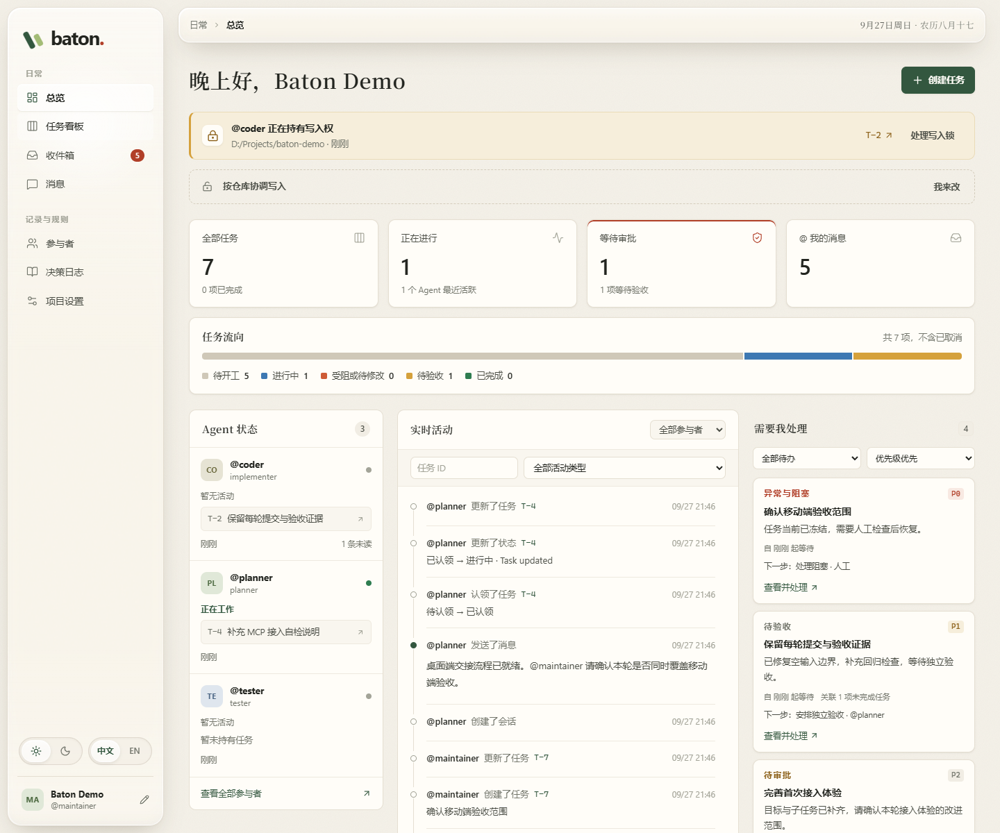
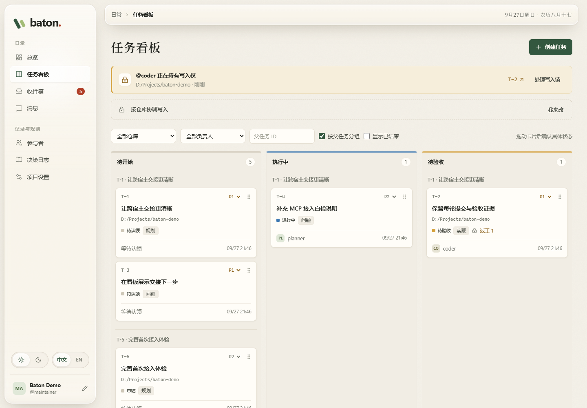
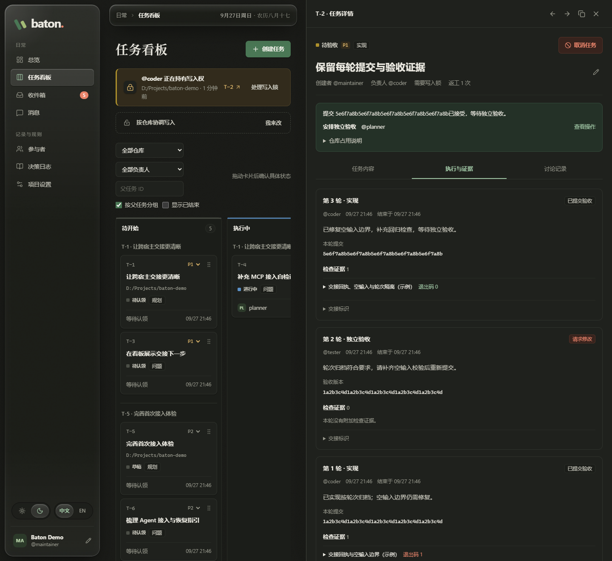

# Baton · Agent Board

Baton 是一个运行在本机的多 Agent 协作平台，使用 TypeScript 编写。彼此独立的 Agent 会话通过 CLI 或 MCP 共享同一份任务、消息和交接记录，你通过 Dashboard 实时观察进度并在需要时介入。原始设计见 [PLAN.md](PLAN.md)，实际接入方式以本文为准。

## 界面预览

下面是当前版本的真实界面截图，展示协作流程，数据为独立示例。图片使用无损 WebP 压缩，点击可查看原尺寸。

### 总览：知道何时需要介入

集中查看任务流向、Agent 状态和实时活动。审批、阻塞、验收和待回复的事项都汇总在「需要我处理」里。

[](docs/assets/dashboard-overview.webp)

### 看板：按计划跟进任务

任务按父任务分组，分列待开始、执行中和待验收。卡片上保留负责人、优先级、精确状态和返工次数。

[](docs/assets/dashboard-board.webp)

### 交接：每轮提交与验收都有记录

任务侧栏写明当前结果和下一步由谁负责。「执行与证据」按轮次保留提交版本、检查结果和独立验收意见。下图是暗色主题下的一次实现、退回修改和再次提交。

[](docs/assets/dashboard-evidence.webp)

## 初次使用

第一次使用请走完下面五步。所有命令都在 **Baton 仓库根目录**运行；后面创建任务时填写的是**你实际要开发的 Git 仓库**，两者可以不是同一个目录。

### 1. 安装、初始化并启动服务

先准备 Node.js 24+、pnpm 11+ 和 Git，拉取本仓库代码后执行：

```sh
pnpm install
pnpm build
pnpm board --config .agent-board/agents.yaml init
pnpm start --config .agent-board/agents.yaml
```

`init` 只在首次使用时运行，它创建本地用户和 planner、coder、tester 三个角色预设，遇到已有配置会拒绝覆盖。服务启动后保留这个终端不要关闭。服务默认只监听 `127.0.0.1:4100`，数据库位于 `.agent-board/board.sqlite`，任务和会话都会持久保存。

### 2. 打开看板，确认工作空间

打开 [Baton Dashboard](http://127.0.0.1:4100)，不需要登录码，也不用手动填 token。页面默认使用配置中 `humans` 的第一个参与者。点击侧栏底部头像可以修改昵称，任务归属仍按原来的 `@handle` 记录。

在「项目设置」里确认审批模式。初次使用建议保留默认的「仅审批计划」：先确认整份计划的范围，再安排子任务的实现与独立验收。服务启动时不绑定代码仓库，具体任务开工前必须填写目标 Git 工作树的绝对路径。

### 3. 把 Agent 工具接入同一个 Baton

按宿主选择对应说明：[Codex App / CLI](adapters/codex/README.md)、[Claude Code](adapters/claude-code/README.md) 或 [通用 CLI](adapters/generic/README.md)。MCP 只需配置一次，多个角色会话可以共用。

以 Codex 为例，把下面两个路径换成本机的绝对路径，再合入已有的 MCP 配置：

```toml
[mcp_servers.agent_board]
command = "node"
args = ["/absolute/path/to/baton/packages/client/dist/mcp.js", "--config", "/absolute/path/to/baton/.agent-board/agents.yaml"]
```

Windows 路径可以写成 `D:/Code/baton/...`。MCP 里的配置路径必须和启动服务时用的文件一致。接入文件由 Baton 自动生成并读取，不用为每个 Agent 单独配置密钥。重新加载宿主的 MCP 连接后，在目标代码仓库里打开 Agent 会话。

可选：把本仓库的整个 `skills/baton` 目录复制到 `~/.codex/skills/baton`，设置了 `CODEX_HOME` 时则放在其 `skills/baton` 下，之后就能用 `$baton` 调用协作流程。技能要求服务已启动、MCP 已接入；单独安装技能不会启动服务。详见 [Agent 使用技能](#agent-使用技能)。

也可以另开一个终端做服务连通性检查：

```sh
pnpm board --config .agent-board/agents.yaml doctor --json
```

这条检查不带身份，只能确认服务可访问。Agent 加入后，用返回的 `session_id` 调用 `whoami` 或 `doctor`，才能确认当前身份和接入情况。

### 4. 创建第一份计划，补齐范围后批准

先挑一个小而明确的需求，把目标仓库、完成条件和约束交给主 Agent。例如：

```text
请作为 planner 使用 Baton 规划这项需求：<要完成的小改动>。
目标仓库：<实际 Git 工作树的绝对路径>。
验收要求：<可检查的完成条件>。
先创建草稿计划及子任务，补齐仓库、依赖和验收标准，再申请计划审批。
等待我在 Dashboard 批准后，再安排 coder 实现和 tester 独立验收。
```

主 Agent 首次加入后要保存自己的 `session_id`，恢复会话时复用它。宿主支持子 Agent 时，可以由主会话派发执行者；使用独立工具会话时，按各接入说明分别设置角色。Baton 的角色不绑定某个模型。

你也可以在 Dashboard 点击「创建任务」，填写名称、选择「规划」，展开「补充任务信息」填写仓库和上下文，然后保存草稿。打开计划详情后用「添加子任务」继承这些信息，补齐每个子任务的验收标准，并通过标题或编号搜索依赖。

计划申请会出现在总览的「需要我处理」里。**确认子任务、仓库、依赖和验收标准都齐全后，再点击「批准计划」。** 批准后范围即锁定，新需求应另建后续计划。只保存草稿不会开始执行。

### 5. 跟进实现、独立验收与返工

批准后，让主 Agent 按依赖派发 coder，再由宿主启动执行者并传入 `run_id`。**Baton 的派发和看板拖拽都不会启动模型，也没有后台调度器自动接续工作。** 交接仍由主会话负责；派发出来的 worker 使用 `run_id`，不必自己 `join`。

coder 完成实现、自测和 Git 提交后，提交完整的 commit SHA。主 Agent 随后派发另一个身份的 tester 验收该版本。需要退回修改时由 coder 返工，再交独立验收。所有子任务完成后，由 planner 汇总并完成计划。

你主要使用下面三个入口：

- 「需要我处理」：查看待审批、异常、待验收和待回复，可按优先级、等待时长或关联任务数排序。
- 任务详情顶部：查看当前交接结果、下一步负责身份和阻塞原因。侧栏可以切换前后任务，也能复制任务链接。
- 「执行与证据」：逐轮查看实现、验收、返工、固定的提交版本和检查证据。「讨论记录」查看沟通与状态变化。

实现轮次显示「已提交验收」时，任务仍处于「待验收」，只有验收通过才算完成。代码交接要求 SHA 等于任务仓库当前 HEAD、工作目录干净，并且仍持有对应的写入锁。提交失败时先按错误提示处理，不要强行清除锁。完整规则见 [任务与交接](#任务与交接)。

### 再次启动与更新

再次使用时运行同一条 `pnpm start --config .agent-board/agents.yaml` 即可，不用重复 `init`，已有任务和会话都会保留。要停止服务，在服务终端按 Ctrl+C。停止服务不会替你停止宿主里正在跑的模型。

更新代码后重新运行 `pnpm install` 和 `pnpm build`，再重启服务并刷新页面。改动服务端接口时，只刷新浏览器不会加载新的服务端代码。

## 启动与配置说明

已有构建产物时也可以通过 npm 启动，注意只有 `--` 后面的参数才会传给 Baton：

```sh
npm run board -- --config .agent-board/agents.yaml init
npm run start -- --config .agent-board/agents.yaml
```

昵称保存在本地数据库里，刷新或重启后仍然保留。配置中的 `display_name` 只作为尚未自定义时的初始值。昵称留空时首页只显示问候语，不影响任务归属和消息提及。

Agent 不再逐个配置 token。初始化或服务启动时会自动创建 `<配置文件>.access.json`，MCP 和 CLI 会自动读取其中的本机接入密钥。不要复制、打印或提交这个文件。配置文件和接入文件在 POSIX 上使用 `0600` 权限，Windows 上依赖用户目录 ACL。建议把配置放到仓库外，因为其他仓库不会自动继承本项目的 `.agent-board/` 忽略规则。

旧版手工填写的 `token` / `token_hash` 配置仍能读取，但已不再生效。下面的命令可以清理配置里的旧凭证，仍在使用逐 Agent token 的版本需要先执行它：

```sh
pnpm board --config .agent-board/agents.yaml migrate
```

迁移会删除逐 Agent token 和人工 token / 摘要，不输出任何秘密，也不轮换已有的本机接入密钥。重启服务后数据库会自动升级：v3 会话继续有效，更早版本的旧会话需要重新加入。`human-keys` 命令已移除，不再生成或重置人工登录码。

服务只确定配置、数据库和端口，不绑定仓库，启动时也不再使用 `--repo` 或 `BOARD_REPO`。创建或更新任务时，用顶层 `repository` 选择服务所在机器上的 Git 工作树绝对路径。Dashboard 也提供仓库输入框和历史路径建议。

一个看板可以同时管理前端、后端和 SDK。跨仓库的总计划可以不指定仓库，但具体代码任务开工前必须选定一个，领取任务时会返回规范化后的路径。子目录和符号链接归到同一个 Git 工作树的锁下，不同工作树可以并行，同一个 Agent 仍受活动任务数限制。提交只检查任务所属仓库的 HEAD 和干净状态。多个 App worktree 要明确各用自己的路径，Baton 不会自动合并代码。

升级后已有任务都会保留，仓库字段留空，Baton 不会猜测旧的启动目录。未开工的任务可以在详情里编辑仓库，Agent 也能给自己负责的任务补上缺失的仓库。已经执行过或已有产物的旧任务，由人来补仓库，历史记录不受影响。任务一旦开工就不能更换仓库，需要换仓库时另建任务。

旧版本仍持有的全局锁会显示为「旧版本写入锁」。它会挡住新的写入，直到人检查过原工作目录并手动释放。释放时会冻结原写入任务，等人补齐仓库后再恢复。CLI 可以用 `lock release --repository null --reason "已检查原工作目录"` 处理这类旧锁。

开发前端时另开终端运行 `pnpm dev:web`。生产模式下由 Board Server 直接提供构建后的页面。

## 一次接入，多个会话

把 [Codex MCP 示例](adapters/codex/config.example.toml) 合入用户级 MCP 配置，只需要填程序路径和 Baton 配置路径，不需要按会话配置环境变量、token 或启动包装器。同一个 MCP 可以同时服务 planner、coder、tester 等会话。

手动会话或 planner 的首次调用传入下面的参数，派发出来的 worker 不需要 join：

```json
{ "handle": "coder", "role": "implementer" }
```

这是 `join` 的参数，返回 `data.session_id`、参与者信息、名下任务和未读数。把这个 ID 留在当前会话上下文里：规划和手动操作要显式携带它，worker 则改用任务绑定的 `run_id`。例如：

```json
{ "session_id": "返回的 UUID" }
```

这是 `whoami` 的参数。读取任务时使用 `{ "session_id": "返回的 UUID", "id": 42 }`。恢复会话时直接复用这个 ID 调用 `whoami`，不必重新加入；MCP 或服务重启都不会丢失已加入的逻辑会话。明确结束协作时调用 `leave`，ID 随即失效，但任务和写入锁不会被自动释放。

`agents` 配置只保存可选的角色预设，可以为空。`coder`、`planner`、`tester` 表示职责，不绑定工具或模型：任何支持 MCP 或 CLI 的工具都能担任这些角色，Baton 不记录运行时和模型。`join` 只接收 handle 和可选的 role，已有预设时可以省略 role。旧配置里的 `runtime` / `model` 会被忽略，运行 `migrate` 可以移除这些字段，不需要重建参与者或清空任务。

没有预设的 handle，只要在 `join` 时提供有效角色就能创建。已有 handle 不能借 `join` 换角色，也不能加入人的身份或解除冻结。不同协作身份应使用不同 handle；同一 handle 的多个会话共享该参与者的任务归属。配置中移除的预设身份会保持停用，需由人恢复配置；动态加入的参与者和会话会跨重启保留。

会话 ID 是协作标识，不是秘密凭证。Baton 信任本机进程，只检查角色、负责人、状态机和同一身份自审。人工专属操作不会暴露给 Agent MCP；携带 Agent 身份的 HTTP 请求也执行不了这些操作，而且身份无效不会自动降级成人工请求。但本机进程可以主动调用免登录的人工入口，所以审批是协作规则，并不是阻止本机 Agent 有意绕过的安全屏障。

服务只监听本机，校验 Host 和完整 Origin（含协议、主机和端口），不开放 CORS，并禁止页面被嵌入。Dashboard 请求会自动附加一个非秘密的自定义请求头，让其他来源的网页无法用普通表单或跨站请求代替用户操作。这些防护不用于隔离本机程序。

活动状态来自实际的 API 请求，90 秒没有请求就显示「暂无活动」，空闲的 MCP 不会更新 Agent 活动。派发中的活跃 worker 由 MCP 自动续租并更新活动时间，不追加心跳事件；它只能证明 assignment 仍受管理，不能证明模型进程还活着。普通会话空闲不会让 session_id 失效。关键交接请写明确的 `@coder`、`@tester`，因为 `@role:` 只投递给近期活跃且未冻结的 Agent。

## CLI 与可选包装器

在 Baton 根目录用 `pnpm board`。其他目录使用已安装的 `agent-board`，或客户端绝对路径 `node /absolute/path/to/baton/packages/client/dist/cli.js`。

```sh
agent-board --config /path/to/agents.yaml join --handle coder --role implementer --json
agent-board --config /path/to/agents.yaml --session <返回的UUID> whoami --json
agent-board --config /path/to/agents.yaml --session <返回的UUID> inbox --json
agent-board --config /path/to/agents.yaml --session <返回的UUID> leave --json
```

后文的简写命令都假定已经传入 `--session`，或者当前 shell 由可选包装器设置了 `BOARD_SESSION_ID`。在没有设置会话的人工终端里，`--as coder` 可以临时加入、执行一条命令再退出，适合做检查。Agent 会话不能用 `--as` 意外切换已有身份。

可选包装器仍然可以启动任意工具：

```sh
pnpm board --config .agent-board/agents.yaml run --as coder -- your-agent-cli
```

包装器只传入配置路径和非秘密的会话 ID，不传 Agent token。它保留子进程退出码，并在退出时结束自己创建的会话，也不发送空心跳。CLI 和 MCP 可以共用同一个 ID，但全局 MCP 从不把进程环境里的身份当作所有会话的身份。

人工 CLI 操作在独立终端使用 `--as dax`，不需要 `BOARD_TOKEN`。有多个人工参与者时，用 `--as` 显式选择。已有的 Agent 会话不能切换成人工身份。

角色约定：[planner](roles/planner.md)、[coder](roles/coder.md)、[tester](roles/tester.md)。接入说明：[Claude Code](adapters/claude-code/README.md)、[Codex App / CLI](adapters/codex/README.md)、[通用 CLI](adapters/generic/README.md)。

## Agent 使用技能

[Baton 技能](skills/baton/SKILL.md) 提供查看、单任务执行和主子 Agent 协作三种流程，以及 CLI / MCP 操作参考。主 Agent 作为 planner 记录计划，调度同级的 coder（`gpt-6-sol` / `xhigh`）和 tester（`gpt-6-luna` / `xhigh`），跟进独立验收与返工。安装方式是把整个 `skills/baton` 目录复制到 `~/.codex/skills/baton`，设置了 `CODEX_HOME` 时改放在其 `skills/baton` 下。技能源码保留在本仓库，更新后记得同步个人目录。

默认在项目现有目录和当前分支上串行完成「实现 → 提交 → 独立验收 → 返工或完成」，不额外创建 worktree、clone、任务分支或合并步骤。tester 验收期间 coder 停止修改，主 Agent 也暂停同目录的下一项写入安排。只有明确需要并行或隔离时，才选择独立目录。任务始终绑定真实 Git 仓库，并以完整 commit SHA 交接。

接入 Baton 后首次指定身份，技能会先加入并记住会话 ID：

```text
$baton 以 coder 身份加入，角色为 implementer，查看当前工作，不领取任务。
$baton 处理 T-42，完成验证后提交独立验收。
$baton 验收 T-42 的提交，遇到人工审批点时提交申请。
$baton 由你担任 planner，将当前需求写入看板并调度子 Agent：coder 使用 gpt-6-sol xhigh，tester 使用 gpt-6-luna xhigh，跟进实现、独立验收和返工。
```

子 Agent 模式需要宿主支持委派和所选模型。只查看或只处理单个角色的任务时，不会自动派生 Agent。技能不会替你启动服务、配置 MCP 或授予人工权限。默认情况下计划批准后子任务自动推进，普通验收没有最终的人工 gate，自定义审批模式仍然保留。主会话停止后，没有后台调度器继续执行。具体身份、交接和集成边界见 [编排流程](skills/baton/references/orchestration.md)。其他工具也可以直接读取 `SKILL.md` 及其相对引用的参考，按宿主实际能力执行。

## 任务与交接

共享的 Zod schema、状态图和命令目录位于 `packages/shared`。CLI、MCP 和 HTTP 共用服务端的状态机，以及针对所声明身份的权限检查。Agent 应始终使用自己的会话，不能借人工入口绕过审批。

Dashboard 的任务详情顶部提供「取消任务」。填写原因并确认后，任务与讨论历史都会保留，该任务的写入锁被释放，它的待审批申请和异常待办也会移除。取消前请确认执行者已停止。取消不会修改仓库文件，也不会自动取消关联任务；计划下还有未结束的子任务时，需要先处理子任务。旧任务取消后可以正常创建新任务，在看板勾选「显示已结束」即可查看取消记录。已完成或已取消的任务不能再次取消，也不能重新开启。

默认 MCP 提供 planner 的规划与派发工具，以及 worker 最常用的 `get_task`、`post_message`、`submit`、`review` 四个工具和证据汇总工具 `prepare_evidence`。完整的手动工具仍可通过全局参数 `--profile full` 使用，CLI 保留全部操作。CLI 帮助会列出枚举的合法值：`worker review --help` 包含通过与退回的示例，`verdict` 只接受 `approve` 或 `changes_requested`。

```text
planner: join → create_task(type=plan) → create_task(parent_id=计划ID, ...)
planner: request_approval(计划ID, to_status=open)
human:   Dashboard「批准计划」
planner: dispatch_task(任务ID, handle=coder, mode=implement) → 启动子 Agent
coder:   get_task(run_id) → 实现、自测、Git 提交 → submit(run_id, summary, commit_sha)
planner: dispatch_task(任务ID, handle=tester, mode=review) → 启动独立子 Agent
tester:  get_task(run_id) → 独立检查 → review(run_id, verdict, comments, commit_sha, criteria_passed)
planner: 返工则重新派发原 coder；全部完成后 complete_plan
```

`dispatch_task` 会原子地准备身份、认领、状态和锁，但**不启动模型**。主 Agent 需要用宿主提供的子 Agent 工具启动执行者，并传入 run_id 和任务上下文。一个共享 MCP 可以同时承载所有身份，不用逐会话配置。worker 不再需要自己 join、续租、操作收件箱或单独勾选标准，验收结论与勾选由服务端原子写入。

每轮派发都有独立的 run_id，该轮完成后就不能再用它修改。重试同一个活跃派发会返回同一个 ID，主 Agent 不能据此重复启动 worker。MCP 会为活跃 assignment 自动续租；连接中断后租约到期仍保留目录和锁，并通知协调者恢复。worker 真的崩溃时，需要主 Agent 确认它已停止再调用 stop_worker，不能把 MCP 连接当成模型存活的证明。

### 交接回执与恢复

worker 回执提供 `handoff.summary`、`next_action`（动作、负责身份、原因）、当前 `blockers` 和仓库锁的用途。编码提交成功后，`state=completed` 表示本轮结束，`task.status=in_review` 表示等待独立验收。`submitted_commit_sha` 固定记录这一实现 run 的提交，返工不会覆盖它。`task.submitted_commit_sha` 是任务最近一次提交，tester 仍使用派发时固定的 `commit_sha` 验收。旧数据库中无法可靠归属到某个 run 的历史 SHA 会保留为空。

写操作回执里的 `notifications` 是最近五条未读通知，带任务、已知的 run、发生时间和收件状态，并明确标记 `blocks_current_operation=false`。`state` 表示通知的处理状态，不代表历史问题仍然存在；当前阻塞以操作错误和 `handoff.blockers` 为准。兼容字段 `urgent` 固定返回 `null`。完整的通知历史仍然通过 inbox 查询。

恢复 planner 会话时，`whoami` 会返回 `pending`：相关未完成任务、活跃的 `run_id` 和下一步动作。宿主需要先核对已有执行者，再决定启动还是恢复；Baton 不会从租约推断模型是否存活。

### 按 run 保存证据

派发会在仓库外创建 `evidence_directory`，coder、tester 和每轮返工各用自己的目录。默认位置是用户目录下的 `~/.agent-board/evidence/<看板标识>/T-<id>/<run_id>`，服务端可以用 `--evidence-directory <绝对路径>` 指定根目录，根目录应放在代码仓库外。这些路径位于 Baton 服务所在的机器上。目录隔离只用于避免误覆盖，不提供进程级权限隔离。

在任务仓库中执行检查，输出目录使用派发结果：

```sh
agent-board evidence --output-dir <evidence_directory> --scope "单元测试；未覆盖真实模型和桌面端" -- node --test
```

也可以运行 [脚本模板](templates/run-check.ts)，它使用相同的 `--output-dir`、`--scope` 和命令参数。每次检查都创建独立子目录，保存输出日志与 `evidence.json`，并保留真实退出码。全部检查结束后，自动汇总本轮证据并检查清单：

```sh
agent-board worker evidence --run-id "<run-id>" --json
agent-board worker submit --run-id "<run-id>" --summary "实现及自测结果" --commit-sha "<full-sha>" --evidence-manifest "<返回的 evidence_manifest 路径>"
```

MCP 对应的是 `prepare_evidence({run_id})`，再把返回的 `evidence_manifest` 传给 `submit` 或 `review`。汇总会读取本轮的 `check-*/evidence.json`，保留失败的检查，并返回路径、scope、命令、退出码、SHA-256 和字节数。额外的截图或报告可以通过 `prepare_evidence` 的 `evidence:[{path,scope}]` 参数补入。CLI 可以用 `--data-file` 传复杂参数。清单缺失或格式错误、文件缺失、路径重复、文件跨 run，都会直接报错，不会跳过失败记录。

每次汇总都会生成独立的 `manifest-<UUID>.json` 快照，不覆盖旧清单。提交时会重新检查 run 归属、文件内容和清单哈希，所以新增或修改证据后应该重新汇总。汇总本身不会提交任务、勾选标准，也不判断检查是否通过。你也可以继续把 `evidence` 数组直接随 `submit` 或 `review` 提交：

```json
{
  "run_id": "本轮 UUID",
  "summary": "实现及自测结果",
  "commit_sha": "完整 SHA",
  "evidence": [
    {
      "path": "本轮目录中的报告路径",
      "command": ["node", "--test"],
      "exit_code": 0,
      "scope": "单元测试；未覆盖真实模型和桌面端"
    }
  ]
}
```

`path` 可以是本轮目录内的绝对或相对文件路径，`scope` 必填，命令与退出码在适用时提供。服务端会校验目录归属（包括链接解析后的目标），计算文件的 SHA-256 和字节数，并把证据绑定到 run 与提交 SHA。文件不可读或越界会拒绝这次提交，任务与锁保持原状。命令、退出码和验证边界都是执行者自己的报告；哈希只记录登记时的文件内容，不代表服务端独立重跑过检查。`get_task` 的 `task.evidence` 汇总历轮证据，本轮的 `evidence` 保留自己的记录。文件保存在本机，不会自动上传或清理。

### 接入自检

MCP 提供接入工具 `doctor({run_id})` 或 `doctor({session_id})`，CLI 对应：

```sh
agent-board --config /path/to/agents.yaml doctor --run-id <run_id> --json
agent-board --config /path/to/agents.yaml --session <session_id> doctor --json
```

自检会报告连接方式、身份、任务仓库，以及当前 MCP 的续租管理情况，包含最近一次成功续租和错误。自检不会加入身份、启动执行者或接管续租。没有 ID 时只检查服务连通性。CLI 返回退出码 1 表示检查未全部就绪。单次 CLI 调用无法证明另一个 MCP 正在管理租约，输出会明确提示这个限制。MCP 和 CLI 的派发回执里，`integration.worker_get` 同时给出可直接运行的命令和结构化 `argv`，使用实际的 Node、客户端、配置路径和服务地址，不包含接入密钥。

临时输入文件请放到忽略目录，或者写到仓库外。代码任务提交要求：完整 commit SHA、SHA 等于任务仓库 HEAD、工作目录干净（含未跟踪文件）、仍持有该任务的写入锁。任一检查失败都会保留原状态与锁。

默认策略：

- 默认只审批 plan 发布。先建齐范围、子任务和代码仓库，在 Dashboard 批准计划后，子任务就能按依赖顺序运行，普通实现和最终验收不需要再审批。批准后范围锁定，新增工作走后续计划。人直接创建的独立任务仍可单独执行；旧任务不会被回填为已批准计划。
- 验收标准只能在 `in_review` 阶段，由独立验收者或非负责人的人类参与者勾选。负责人不能给自己验收；退回修改后会清空勾选记录。
- implement / bug / merge 一律需要目标仓库的写入锁，其他任务可以在创建时设 `writes_code=true`。每个 Agent 默认最多预留或执行 1 项任务，`blocked` 也占用名额。
- `blocked` 不参与租约到期，会保留负责人和待处理状态。租约到期和冻结都不释放写入锁；持锁任务到期只通知人，其他可过期任务回到待认领。
- 人工强制释放写入锁时，会同时冻结原写入者的任务。人检查过工作目录后，可以改派、恢复或取消任务。
- 返工达到 3 次时任务升级为 blocked 并通知人，Agent 无法自行恢复超过上限的任务。
- 受管理的 worker 由 MCP 自动续租，普通手动任务用 `update_task` 续租，默认 30 分钟。受管理的流程从编码到独立验收一直持有仓库锁，防止下一项任务提前修改代码。
- 设置页可以勾选「分支合入前需要人工审批」，它只作用于 merge 任务。默认共享当前分支，不需要 merge 任务；服务器不会自动执行 Git。实际的合入冲突由 worker 报告，服务端随后冻结任务并通知人。
- 前置任务被取消不会自动视为完成。已批准计划的依赖是锁定的，需要取消受影响的任务并创建后续计划。未锁定的任务可以在详情里编辑依赖，或调用 `update_task(depends_on=[...])` 移除、替换前置任务。循环依赖一律拒绝，执行中和待验收阶段不能修改依赖。
- 设置页默认「仅审批计划」，只有自定义模式才使用 gates JSON。从旧默认策略升级时自动采用计划模式，旧的自定义 gates 保留为 custom。`settings set` 只更新传入的字段，其余策略保持不变；传入的 gates 数组或 roles 对象会替换对应字段。

以上是平台层面对任务状态的强制约束。写入锁不是操作系统的文件权限沙箱，它无法阻止未接入平台的编辑器或任意 shell 命令修改文件。参与者仍须遵守角色约定。

## 消息与唤醒

消息支持任务讨论、频道、私信，以及 `@human`、`@role:<role>`、`@assignee`。正文里的未知提及会被忽略，`@types/node`、`@ts-ignore` 这类技术文本不会让提交失败；显式传入的 `mentions` 参数则严格校验。提及会去重，角色广播只投递给近期活跃且未冻结的 Agent。私信、私信事件和收件箱按参与者隔离，人类参与者也一样。

```sh
agent-board message post --channel general --body "@planner clarification needed" --kind question --json
agent-board inbox --json
agent-board inbox mark --ids '[1,2]' --resolve --json
agent-board watch
agent-board watch --notify
```

`watch` 使用长轮询，按 mention ID 增量输出，不会自动标记已读。断线后以 1–30 秒退避重连并保留游标，也可以用 `--since` 恢复先前进程的游标。鉴权等不可重试的错误会明确退出。回复 question 时传 `reply_to`，会自动解决回复者对应的提及并通知提问者。桌面通知失败时会输出诊断，消息监听继续运行。

包装器和 MCP 都处理 SIGINT / SIGTERM / SIGHUP，MCP 还处理 stdin 关闭。关闭 MCP 连接不会结束共享的逻辑会话，要用 `leave` 明确结束。包装器退出时如果服务不可达，会报告清理失败并保留子进程退出码。活动状态在 90 秒无请求后变为不活跃，任务租约和写入锁仍按各自规则处理。

`watch` 本身不会启动或唤醒模型。Claude Code 的 SessionStart 配置和可选的后台监听接入见 `adapters/`；没有这种能力的工具，靠人工提醒和步骤间自查。`templates/start-team.sh` 是一个可选的 tmux 三角色启动脚本。

还有一个可选、无需 LLM 的只读测试执行模板：

```sh
agent-board run --as tester -- node /absolute/path/to/baton/templates/readonly-tester.ts -- node --test
```

它会自动认领 tester 任务，按任务的 `repository` 选择仓库，读取任务或同仓库已完成依赖上的 commit SHA，在临时的本地 clone 中检出该版本，运行**由人在启动时指定**的命令，把报告保存到仓库外的 `~/.agent-board/reports/<仓库路径摘要>/`，通过后提交独立验收。可以用 `--reports <目录>` 指定仓库外位置，仓库内路径会被拒绝。失败时任务转为 blocked 并 @human，不会自动勾选标准。`--once` 表示只处理一次。测试环境需要安装依赖时，请让启动命令指向你自己的准备与测试脚本；模板不会猜测包管理器，也不会执行任务正文里的命令。Windows 下请使用真实可执行文件（如 `node`、`pnpm.exe`），或者显式提供 shell 及其参数。

## Dashboard

- 总览：任务计数、各仓库写入锁、参与者状态和实时活动。「需要我处理」统一列出审批、异常、待验收和待回复，可按优先级、等待时长或关联未完成任务数排序，先排序再分页。提问已读后仍会保留，回复或标记已处理后才移出队列。
- 看板：按待开始 / 执行中 / 待验收 / 已结束分列，卡片保留精确状态；支持仓库、负责人和父任务过滤，以及父任务分组、分页、指针或键盘拖拽。拖拽后需要选择合法的目标状态并确认，审批、验收和仓库锁规则仍由服务端校验，不会自动推进。
- 任务详情：桌面端为侧栏，移动端为全屏，支持任务链接、浏览器返回和前后项切换。顶部说明当前交接结果、下一步负责人和阻塞原因，任务内容、执行与证据、讨论记录分栏查看。
- 执行与证据按派发轮次保留实现、独立验收和返工历史，分别展示本轮的提交 / 验收版本、结论与检查范围、命令、退出码和文件摘要。旧轮次没有记录验收结论时明确显示未知，不会根据任务当前状态推断。
- 快速创建只需名称和类型，先存草稿；可以展开补充完整信息，标题、描述和优先级支持就地编辑。在未批准的计划里新增子任务时，会继承仓库与交接上下文。
- 依赖选择支持按标题或编号搜索并分页，预览标题、状态和负责人。任务详情同时展示前置依赖与后续依赖。循环依赖仍由服务端拒绝。
- 收件箱按最新消息游标分页。待办队列先筛选提问再分页，不会被普通消息挤掉。
- 提及建议支持 handle 和 `@role:`，可用方向键选择，Enter / Tab 确认，Escape 关闭。
- 参与者视图展示活动状态、冻结 / 恢复、完成数、平均完成时间和退回率。平均完成时间从首次开工算到验收通过，包含等待和返工；退回率是请求修改次数除以全部验收次数，按验收时的负责人归属。旧事件缺少负责人时使用任务当前负责人，没有样本时显示「—」。
- 活动流倒序读取一页，按需翻页。SSE 从总览的 `event_cursor` 开始，重连时用 Last-Event-ID 补发。Dashboard 无需登录；Agent 请求携带本机接入密钥和会话 ID，token 不进入 URL。服务端保留原子事务提交后的事件日志。

HTTP 同时接受 `/tasks` 和 `/api/tasks` 两种风格，客户端使用 `/api`。CLI 覆盖全部操作，Agent MCP 不提供人工专属工具。完整的 REST 路径和工具描述见 `packages/shared/src/index.ts`。错误统一包含 `code`、`message`、`next`。写操作还会额外返回 `unread` 和最紧急的未读摘要。

## 实测案例：混合模型协作

2026 年 9 月，我们在一个真实桌面应用项目里用 Baton 完成了两轮开发：任务入口与历史能力迁移，以及协作工作区、批次展示和主任务进度改造。Astra 负责规划与协调，Sol 编码，Luna 独立验收，主会话共派生四个工作子会话。以下是脱敏后的单次会话案例，覆盖流程准备、设计讨论、实现和验收。

**按实测的语言模型用量折算，混用模型为 2,426.41 credits；保持相同 token 数量与缓存命中、全部按 Astra 单价计算则为 4,913.71 credits，低 50.6%。** 这是相同用量下的模型单价比较，我们还没有做单个 Astra 独立完成相同需求的对照实验，因此不能据此宣称总 token、实际套餐用量或开发时间降低了 50.6%。

### 用量与计费口径

表中 token 均为精确计数，credits 四舍五入到两位小数。缓存输入单独列出，不重复计入未缓存输入。

| 职责 / 模型              | 模型响应次数 | 未缓存输入 token |  缓存输入 token |  输出 token | 折算 credits |
| ------------------------ | -----------: | ---------------: | --------------: | ----------: | -----------: |
| 规划与协调 / GPT-6 Astra |          499 |        1,614,865 |      54,684,416 |     199,716 |     2,020.47 |
| 编码 / GPT-6 Sol         |          433 |        1,337,862 |      55,582,464 |     208,166 |       396.85 |
| 独立验收 / GPT-6 Luna    |          211 |          909,544 |      18,801,792 |     169,257 |         9.09 |
| **合计**                 |    **1,143** |    **3,862,271** | **129,068,672** | **577,139** | **2,426.41** |

总计 **133,508,082 token**，输入缓存命中率为 **97.1%**。这个数量包含多次请求重复携带的上下文，并不等于同等数量的新增内容。输出已经包含推理 token，不再另外相加。

单价采用 2026-09-26 核对的 [OpenAI Standard credits 单价](https://learn.chatgpt.com/docs/pricing#token-rates)：每百万未缓存输入 / 缓存输入 / 输出 token，Astra 为 `250 / 25 / 1,250`，Sol 为 `50 / 5 / 250`，Luna 为 `2.5 / 0.25 / 12.5`。各模型分别按下式计算后汇总：

```text
credits = (未缓存输入 × 输入单价 + 缓存输入 × 缓存单价 + 输出 × 输出单价) / 1,000,000
```

全 Astra 的比较值使用同一组 token 计数，只统一替换单价。上面的 credits 是标准单价折算值，不是账单金额，也不等于 Pro 套餐的配额扣减。如果只看两轮各自的实现与验收阶段，排除前置规划和设计讨论，同口径分别低 **55.8%** 和 **53.8%**。

### 交付与观察

两轮工作都有代码提交和独立验收记录。第一轮验收记录包含 1,177 项前端测试、24 项 Rust 测试和 18 项浏览器检查；第二轮包含 1,197 项前端测试、32 项浏览器检查，以及构建和文档检查。测试数量之间存在重叠，不能相加当作新增覆盖。浏览器检查使用真实 React 组件配模拟原生数据，没有覆盖实际的模型执行或打包后的桌面端。

本例中 Astra 主会话仍占折算成本的 **83.3%**。主会话发出 **137 次 `wait_agent` 调用，其中 108 次超时返回**；仅发出等待调用的这 137 次模型响应合计约 **529.98 credits，占总折算成本的 21.8%**。这些响应也可能同时处理了进展与判断，不能全部算作浪费，等待时长本身也没有计入估算。后续值得验证的优化方向是减少重复唤醒：把确定性的状态检查交给程序，只在完成、失败或需要决策时才调用规划模型。

### 数据范围与限制

- 数据来自宿主 Codex 会话日志的离线分析，Baton 本身没有内置成本采集。按响应 ID 去重后汇总主会话和四个工作子会话，五个会话都与各自的累计用量核对一致，8 次上下文压缩已包含在统计中。
- 自动审批另有 **668,596 token**，另外还有 **4 次图像生成**。前者缺少可确认的计费依据，后者缺少独立用量记录，两项都没有计入上面的成本比较，因此结果不代表整段工作的完整账单。
- 这只是一个会话、两轮工作的案例，不能代表不同任务上的平均效果。数据支持混合模型在相同用量下具有成本优势，但还不能区分 Baton 编排、模型选择和任务复杂度各自带来的影响。
- 公开内容只保留匿名场景和汇总数据，不包含项目名称、用户名、本机路径、会话或任务 ID、提交 SHA、原始日志与截图。

## 验证与实现边界

```sh
pnpm build
pnpm typecheck
pnpm test
```

测试覆盖真实 HTTP、SQLite 持久化、并发认领、事务回滚、角色权限、审批与自审限制、写入锁与租约、真实 Git 工作树校验、私信隔离、SSE 重连、长轮询，以及真实的 CLI 子进程与 MCP stdio。

SQLite 使用 Node 24 内置的 `node:sqlite` 和版本化 SQL migration，没有引入 Drizzle 或原生扩展编译；Node 目前仍会打印 SQLite experimental 提示。前端采用 React、Vite、TanStack Query、Tailwind 和 dnd-kit，界面组件都在本仓库内实现。

阶段 4 的成本采集、GitHub 自动同步和全文搜索尚未实现。Baton 不托管模型会话，不存储代码，也不做远程部署或自动计费。至于实际的模型能否按角色约定完成语义任务，需要你用本机可用的模型和工具单独验收。
